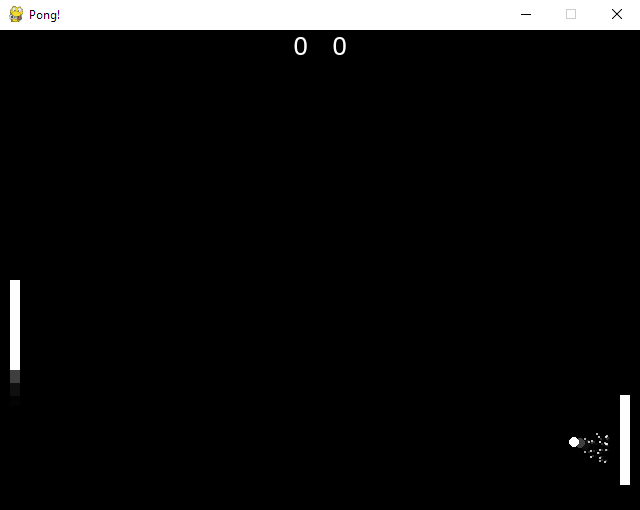

# Pong!



This is my clone of Pong, one of the first computer games.

The visuals do not match because I wanted to use my own visual style.
(Even if it is similar.)

The game is "endless"; just keep racking up points and see how many you can get over the AI.

You're the paddle on the right. _The AI plays very well... so good luck!_


## Cloning this thing

First, install Python, duh...

(I coded this thing on 3.13.5, so I'd get that version or something later)

Clone the repo.

```
git clone https://github.com/Carstyle476/pong pong
cd pong
```

Install required packages. (Literally just pygame)

```
pip install -r requirements.txt
```

Then you can run the game.

```
py pong.py
```

The "release" is a .zip file containing pong.py, requirements.txt, and the sounds folder.

This is all you need.

Enjoy!

[Credits](CREDITS.md)
